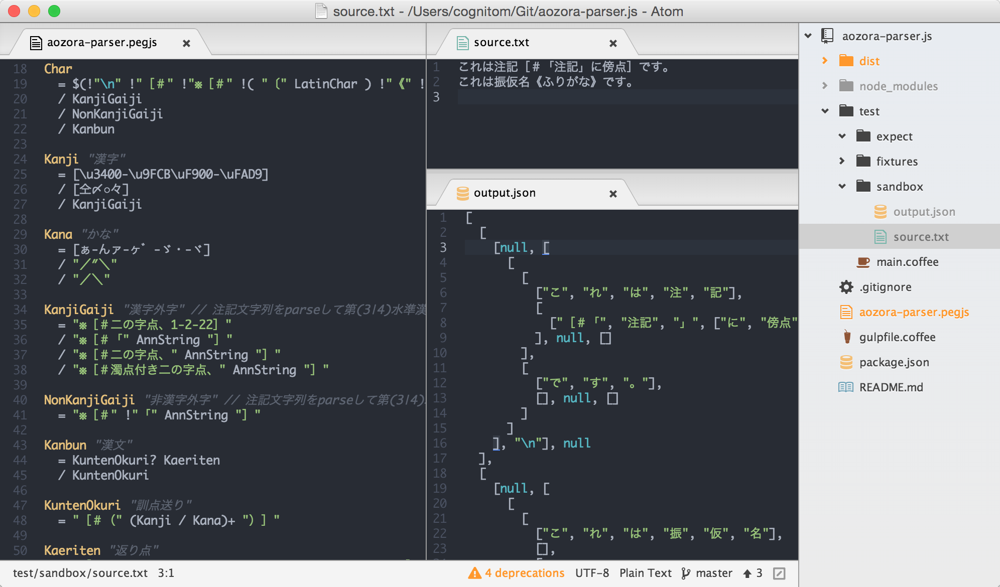

# aozora-parser.js

青空文庫テキストフォーマットのパーサー (試験実装中...)


## 準備

- インストール: `$ npm install`
- テスト: `$ npm test`


## 開発

ファイル監視の開始をするには、次のコマンドを打ちます。

```
$ npm start
```

この状態で、

- `aozora-parser.pegjs`
- `test/sandbox/source.txt`

のどちらかを編集すると、自動的に`test/sandbox/output.json`が更新されるので、3画面を開いて進めると良さそうです。(パーサーも`dist/aozora-parser.js`に出力されています)

 


## Licenses

- aozora-parser.pegjs: BSD @kawabata氏の[LISP版](https://github.com/kawabata/aozora-proc)を元に、@takahashimさんの[gist](https://gist.github.com/takahashim/5b049a305128dcd12245)を経由して移植しました。
- その他: MIT
